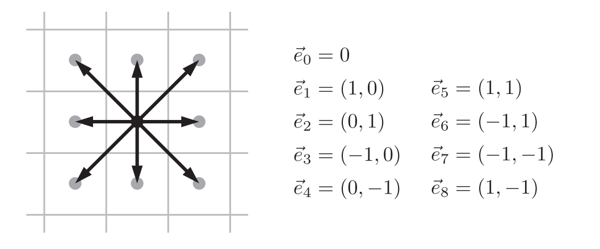

# vku_Pythonlearning


&emsp;&emsp;假设流体是理想气体，且宏观速度 $\boldsymbol{u}=0$ ，在温度为 $T$ 时处于热平衡状态，那么分子的热运动满足统计力学的玻尔兹曼分布，对于二维气体来说，满足以下分布函数：
$$\displaystyle
D(\vec{v})=\frac{m}{2\pi kT}e^{-m|\vec{v}|^{2}/2kT}$$

其中， $m$ 表示分子质量， $k$ 为玻尔兹曼常数。玻尔兹曼分布函数在分量 $v_x$ 和 $v_y$ 上积分时，给出一个特定分子在一个速率范围的可能性（注意归一化）。

&emsp;&emsp;在lattice-Boltzman方法中，我们把时间和空间离散化，在每个格子中处理离散的速度矢量，也就是D2Q9格子，如图1.2所示。


<center>
    <font size="1">
    图1.2&emsp;D2Q9网格示意图
    </font>
</center>

&emsp;&emsp;接下来，我们需要把概率附加到这九个速度矢量上，尽可能精确地模拟连续Boltzmann分布。根据玻尔兹曼分布函数，最优的概率分布是 $\omega_{0}=\frac{4}{9} , \omega_{1}=\omega_{2}=\omega_{3}=\omega_{4}=\frac{1}{9} , \omega_{5}= \omega_{6}=\omega_{7}=\omega_{8}=\frac{1}{36}$. 

&emsp;&emsp;这些权重具有明确的定性属性，且它们满足归一化。同时，他们也能够预测相同时刻下 $v_x$ 和 $v_y$ 的值，以及 $v_x$ 和 $v_y$ 的次方（直到四次方）。

&emsp;&emsp;在用lattice-Boltzmann方法进行模拟时，最基础的动态变量是每个格子的9个方向密度，因此，我们需要构建9个二维数组去表示不同的方向密度，代码实现如1.3所示。

```python
height = 32     # 网格高度
width = 300     # 网格长度
# 微观晶格方向密度
n0 = numpy.zeros((height, width))
nN = numpy.zeros((height, width))
nS = numpy.zeros((height, width))
nE = numpy.zeros((height, width))
nW = numpy.zeros((height, width))
nNW = numpy.zeros((height, width))
nNE = numpy.zeros((height, width))
nSE = numpy.zeros((height, width))
nSW = numpy.zeros((height, width))
```

<center>
    <font size="1">
    代码1.3&emsp;定义微观晶格方向密度
    </font>
</center>

&emsp;&emsp;重要的是在上面所构建的网格内定义流场，以及物理碰撞过程。根据 $\omega_i$ 的性质，有
$$\displaystyle
\int_{-\infty}^{+\infty}\int_{-\infty}^{+\infty}v_{x}^{2}D(\vec{v}){\rm d}v_x{\rm d}v_y=\sum_{i=0}^{8}(e_{i,x}·c)^{2}\omega_{i}, etc.$$

&emsp;&emsp;左式是根据玻尔兹曼分布计算得到的 $v_{x}^{2}$ 的均值，而右式则是经过格子方法离散化得到的相同的平均值。其中， $\omega_i$ 应取到合适的值（即上文所列），所以常数 $c$ 必须只和温度有关：
$$\displaystyle
c^2=\frac{3kT}{m}$$

&emsp;&emsp;上述讨论同样适用于静止的流体。而对于宏观速度不为0的流体，每个分子的合速度就是宏观速度 $\vec{u}$ 加上热速度 $\vec{v}$ ：
$$\displaystyle
\vec{e_i}·c=\vec{u}+\vec{v}$$

而对于热速度分布的玻尔兹曼函数不受宏观速度 $\vec{u}$ 的影响，所以
$$\displaystyle
D(\vec{v})\rightarrow\frac{m}{2\pi kT}\exp(-\frac{m}{2kT}|\vec{e_i}c-\vec{u}|^{2})$$

再对上式作泰勒展开，得到
$$\displaystyle
D(\vec{v})\rightarrow\omega_{i}\bigg[ 1+\frac{3\vec{e_i}·\vec{u}}{c}+\frac{9}{2}(\frac{\vec{e_i}·\vec{u}}{c})^{2}-\frac{3}{2}\frac{|\vec{u}|^{2}}{c^{2}}\bigg].$$

&emsp;&emsp;在任意一个给定的时刻，每个格子的9个方向密度会有任意的正值。根据这九个参量，我们可以计算总的密度 $\rho$ ,以及平均（宏观）速度在x和y方向上的分量 $u_x$ 和 $u_y$ 。再根据这三个宏观量，我们可以求出热平衡状态下，每个格子微观的九个方向密度：
$$\displaystyle
n^{eq}=\rho \omega_{i}[1+3\vec{e_i}·\vec{u}+\frac{9}{2}(\vec{e_i}·\vec{u})^{2}-\frac{3}{2}|u|^{2}].$$

这个式子和概率的表达式相同，只需要乘上总的密度 $\rho$ 并取 $c=1$ 。如果把所有的9个方向密度设为这些平衡值，可以模拟分子间的碰撞过程，从而使它们更接近热平衡的状态。但是达到平衡的时间不一定和模拟的步长相同。因此，更一般的过程是将用一个可变的分数将每个 $n_i$ 的值改为平衡值：
$$\displaystyle
n_{i}^{new}=n_{i}^{old}+\omega(n_{i}^{eq}-n_{i}^{old})$$

这里的 $\omega$ 是一个介于0和2之间的可变的数。 $\omega$ 越小，意味着碰撞需要更长的时间才能使密度达到平衡；而 $\omega$ 越大意味着碰撞发生得越快。

&emsp;&emsp;再通过进一步的分析，在单位时空离散程度 $\Delta x=\Delta t=1$ 时，我们可以定义和碰撞系数 $\omega$ 相关的运动粘度系数: 
$$\displaystyle
\nu=\frac{1}{3}(\frac{1}{\omega}-\frac{1}{2})$$

当 $\omega=1$ 时，$\nu=\frac{1}{6}$ ，当 $\omega=0$ 时，$\nu$ 正无穷大，而当 $\omega=2$ 时，$\nu=0$.  

所以，lattice-Boltzmann算法如下：

<b>(1).流场</b>
通过遍历，复制相应的 $n_{i}$ 值，将所有分子移动到相邻的或对角线的晶格位置。

<b>(2).碰撞</b>
对于每个格子，执行以下操作：
(a. 根据9个微观的方向密度，计算宏观密度 $\rho$ 和速度分量 $u_x$ 和 $u_y$ ；
(b. 再根据这三个宏观变量，计算平衡的数密度 $n_{i}^{eq}$ ；
(c. 重复更新每个格子的9个方向密度。

<b>(3).边界条件</b>
我们使用一个布尔数组来标记哪些晶格位置包含障碍物而不是流体。然后在每一个流动步骤期间或之后，任何通常会流入这些部位之一的流体，应该直接反弹到它来自的部位，再以相反的速度移动。


## 参考资料：

“1.1Navier-Stokes方程——流体中的牛顿第二定律”https://zhuanlan.zhihu.com/p/624347343

“1.2Navier-Stokes方程——对流导数”https://zhuanlan.zhihu.com/p/624352446

“为什么会出现卡门涡街？”https://www.zhihu.com/question/42116401

"Lattice-Boltzmann Fluid Dynamics"——Physics 3300, Weber State University, Spring Semester, 2012
https://physics.weber.edu/schroeder/javacourse/LatticeBoltzmann.pdf